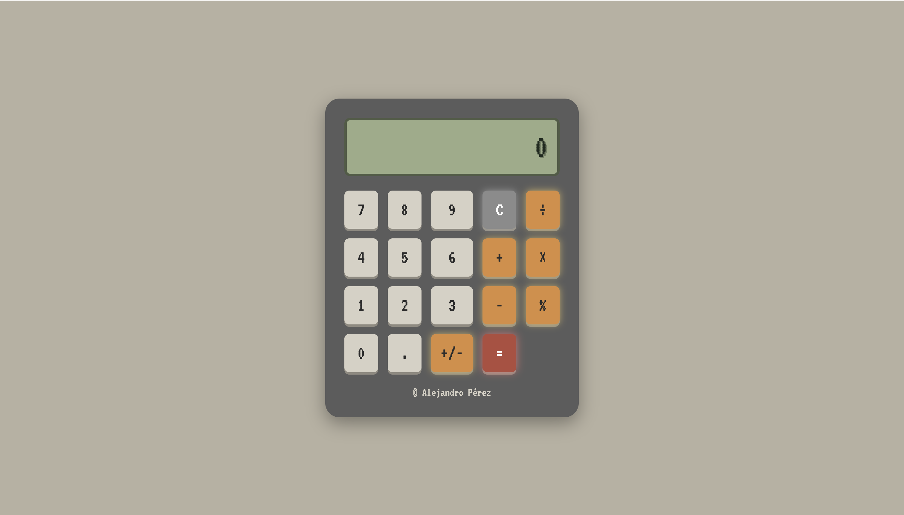

# Vintage Calculator

A retro Casio-inspired calculator built with React, TypeScript, Bun, Storybook, and Vitest.

This project was designed with a strong emphasis on frontend architecture, component separation, testing, accessibility, and tooling.

---

# Features

## Core Operations

* Addition (`+`)
* Subtraction (`-`)
* Multiplication (`×`)
* Division (`÷`)
* Modulo (`%`)
* Equals (`=`)
* Clear (`C`)

---

## Advanced Features

* Decimal support
* +/- toggle support
* Chained operations
* Overflow handling
* Negative result handling
* 9 character display limit
* ERROR states

---

# Design

The calculator was heavily inspired by vintage Casio calculators and retro LCD interfaces.

Design decisions include:

* VT323 retro digital typography
* LCD-inspired display styling
* Operator glow feedback
* Compact centered calculator layout
* Custom retro calculator favicon
* Vintage-inspired color palette

The operator buttons include glow feedback to improve the user experience while preserving the behavior of classic physical calculators.

---

# Architecture Philosophy

This project intentionally separates visual components from business logic.

Components were designed visually first and intentionally separated from calculator logic.
All calculator logic lives inside a custom hook.
This made testing, Storybook integration, component reuse, and maintenance significantly easier.

Development followed this workflow:

```txt
isolated components
→ component composition
→ calculator state management
→ testing
→ final integration
```

## Component Responsibilities

### Button

Responsible only for rendering reusable calculator buttons.

### Display

Responsible only for rendering the current calculator value.

### Keyboard

Responsible only for organizing calculator buttons and emitting button press events.

### useCalculator

Responsible for all calculator state and logic.

This includes:

* operations
* overflow handling
* ERROR states
* decimal handling
* +/- toggling
* chaining operations
* validation rules

---

# Testing

The project uses:

* Vitest
* React Testing Library

Tests focus on real user interaction and calculator behavior rather than implementation details.

## Tested Scenarios

* Number concatenation
* Display character limit
* Addition
* Division
* Modulo
* Decimal support
* Duplicate decimal prevention
* Chained operations
* Overflow ERROR
* Negative result ERROR
* Clear functionality
* +/- toggle behavior

---

# Storybook

Storybook was used to document and visually test components in isolation.

Stories include:

* Button variants
* Display states
* Keyboard layout
* ERROR state
* Calculator previews

---

# Accessibility

The calculator includes accessibility improvements such as:

* `aria-label` support for calculator buttons
* semantic interaction testing
* accessible display querying

---

# Tech Stack

* React
* TypeScript
* Vite
* Bun
* Vitest
* React Testing Library
* Storybook
* ESLint
* GitHub Actions

---

# Installation

## Clone the repository

```bash
git clone https://github.com/alejandro-gperez/react-calculator
```

---

## Install dependencies

```bash
bun install
```

---

# Running the Application

```bash
bun run dev
```

---

# Running Tests

```bash
bun run test
```

---

# Running Lint

```bash
bun run lint
```

---

# Running Storybook

```bash
bun run storybook
```

---

# Continuous Integration

GitHub Actions automatically runs:

* lint
* tests

on every push and pull request.

---

# Screenshot



---

# Reflection

This project reinforced the importance of separating UI from logic in frontend applications.

Designing components visually first before implementing calculator logic made the project significantly easier to test, maintain, and extend.

The custom `useCalculator` hook centralized all calculator behavior and prevented logic from leaking into UI components.

Storybook also proved extremely useful for developing and validating components in isolation before integrating them into the calculator.

Using Vitest and React Testing Library encouraged testing from the user's perspective rather than testing implementation details.

The combination of React, TypeScript, Storybook, and Vitest felt modern, scalable, and very enjoyable to work with.

I would absolutely use this stack again for future frontend projects.

---

# Deployment

The application is deployed at:

```txt
<DEPLOY_URL>
```

---

# Author

Alejandro Pérez

